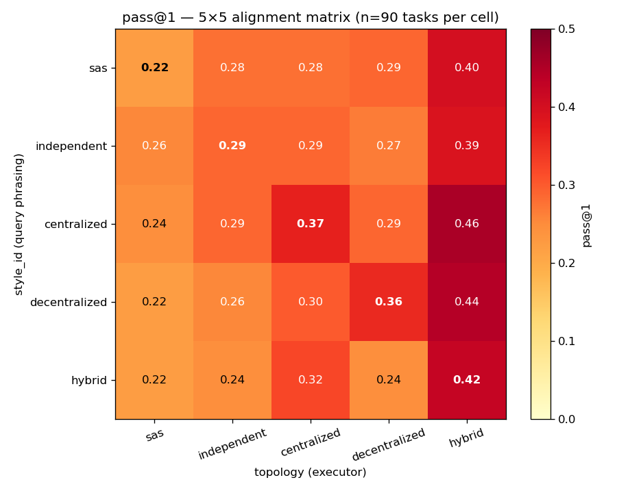
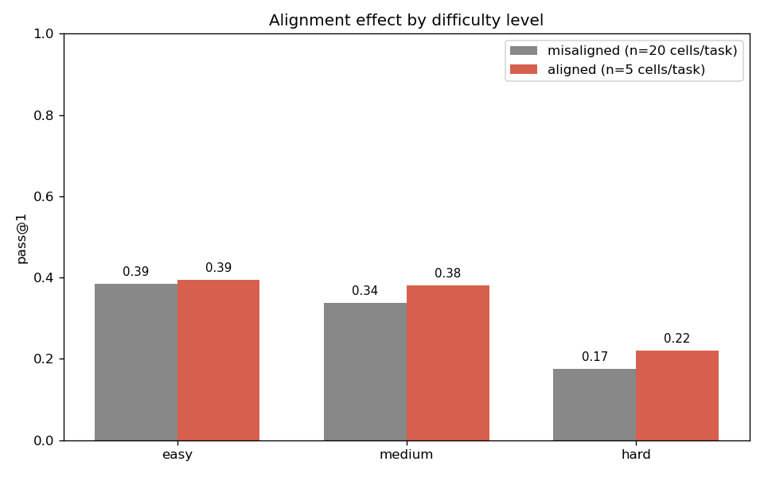
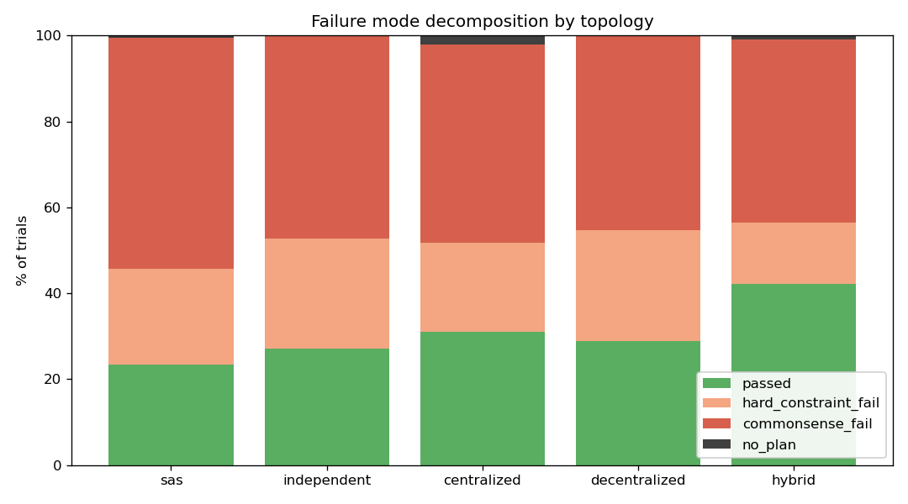
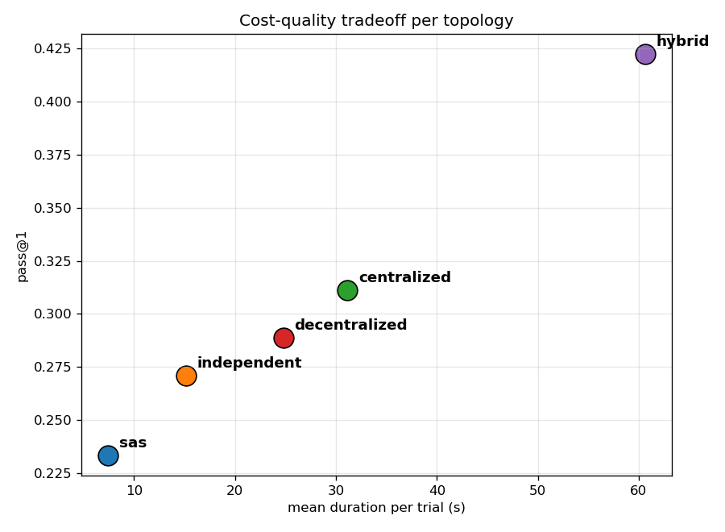

# Thinking-style × Topology Analysis

- N trials: **2250**

- N tasks: **90** (90 task pilot, 9 difficulty cells × 10 tasks)

- Overall pass@1: **30.53%**

- Styles: sas, independent, centralized, decentralized, hybrid

- Topologies: sas, independent, centralized, decentralized, hybrid


## A. Alignment hypothesis

### A.1 5×5 pass@1 matrix (rows = style, cols = topology)

```
topology        sas  independent  centralized  decentralized  hybrid
style_id                                                            
sas           0.222        0.278        0.278          0.289   0.400
independent   0.256        0.289        0.289          0.267   0.389
centralized   0.244        0.289        0.367          0.289   0.456
decentralized 0.222        0.256        0.300          0.356   0.444
hybrid        0.222        0.244        0.322          0.244   0.422
```




### A.2 Marginal effects

**Style (query phrasing) main effect:**

```
               mean  count
style_id                  
sas           0.293    450
independent   0.298    450
centralized   0.329    450
decentralized 0.316    450
hybrid        0.291    450
```

**Topology (executor) main effect:**

```
               mean  count
topology                  
sas           0.233    450
independent   0.271    450
centralized   0.311    450
decentralized 0.289    450
hybrid        0.422    450
```


### A.3 Diagonal vs off-diagonal — paired Wilcoxon (per-task)

- aligned mean (per-task pass@1): **0.3311**

- misaligned mean (per-task pass@1): **0.2989**

- mean diff (aligned − misaligned): **+0.0322**

- Wilcoxon W = 1256.0, p = 0.005995 (one-sided H1: aligned > misaligned)

- Cohen's d (per-task diff): 0.238

- N paired tasks: 90


### A.4 Per-pair alignment effect (diagonal cell vs row off-diagonal mean)

```
         pair  aligned  off_diag_mean   diff
          sas    0.222          0.311 -0.089
  independent    0.289          0.300 -0.011
  centralized    0.367          0.319  0.047
decentralized    0.356          0.306  0.050
       hybrid    0.422          0.258  0.164
```


## B. Difficulty moderator

### B.1 by level

```
aligned  misaligned  aligned  diff
level                             
easy          0.385    0.393 0.008
medium        0.337    0.380 0.043
hard          0.175    0.220 0.045
```




### B.2 by 9-cell (level × days)

```
aligned      misaligned  aligned   diff
level  days                            
easy   3          0.590    0.640  0.050
       5          0.340    0.340  0.000
       7          0.225    0.200 -0.025
hard   3          0.220    0.260  0.040
       5          0.180    0.200  0.020
       7          0.125    0.200  0.075
medium 3          0.475    0.580  0.105
       5          0.340    0.340  0.000
       7          0.195    0.220  0.025
```


## C. Failure mode

### C.1 Per-topology distribution (% of trials)

```
fail_reason    passed  hard_constraint_fail  commonsense_fail  no_plan
topology                                                              
sas             23.33                 22.44             53.78     0.44
independent     27.11                 25.56             47.33     0.00
centralized     31.11                 20.67             46.22     2.00
decentralized   28.89                 25.78             45.33     0.00
hybrid          42.22                 14.22             42.67     0.89
```




### C.2 Hard-constraint pass rate per topology (conditional on commonsense gate passing — denominator below)

**Pass rate:**

```
constraint     valid_cost  valid_cuisine  valid_room_rule  valid_room_type  valid_transportation
topology                                                                                        
sas                 0.667          0.971            0.844            0.966                 1.000
independent         0.688          0.970            0.822            0.970                 1.000
centralized         0.725          0.971            0.905            0.973                 1.000
decentralized       0.690          0.961            0.833            0.965                 1.000
hybrid              0.815          0.987            0.936            0.974                 1.000
```

**Sample size (n):**

```
constraint     valid_cost  valid_cuisine  valid_room_rule  valid_room_type  valid_transportation
topology                                                                                        
sas                   417            417              417              417                   417
independent           433            433              433              433                   433
centralized           411            411              411              411                   411
decentralized         432            432              432              432                   432
hybrid                389            389              389              389                   389
```


## D. Cost

```
               pass_at_1  duration_mean  duration_median  msg_count_mean  pass_per_second
topology                                                                                 
sas                0.233          7.434            6.056           1.000            0.031
independent        0.271         15.185           13.622           4.000            0.018
centralized        0.311         31.155           26.770           4.200            0.010
decentralized      0.289         24.802           21.720           7.000            0.012
hybrid             0.422         60.647           52.077           7.338            0.007
```




## E. Off-diagonal asymmetry

Pairs (i, j) where M[i, j] = pass@1(style_i, topology_j) and the transpose, sorted by |diff|.


```
                       pair  style_i_topo_j  style_j_topo_i  abs_diff
     decentralized ↔ hybrid           0.444           0.244     0.200
               sas ↔ hybrid           0.400           0.222     0.178
       independent ↔ hybrid           0.389           0.244     0.144
       centralized ↔ hybrid           0.456           0.322     0.133
        sas ↔ decentralized           0.289           0.222     0.067
          sas ↔ centralized           0.278           0.244     0.033
          sas ↔ independent           0.278           0.256     0.022
independent ↔ decentralized           0.267           0.256     0.011
centralized ↔ decentralized           0.289           0.300     0.011
  independent ↔ centralized           0.289           0.289     0.000
```
