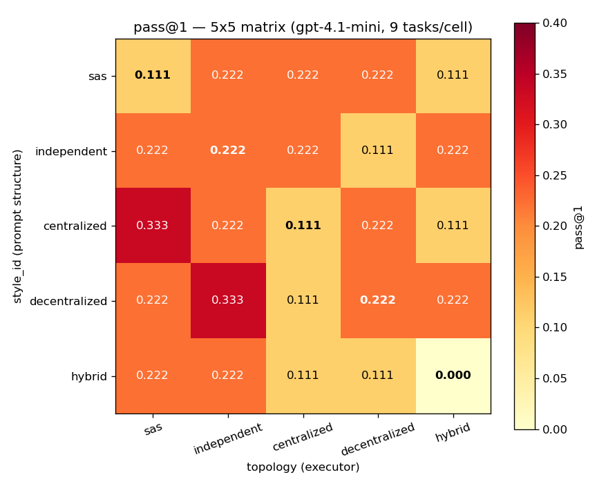
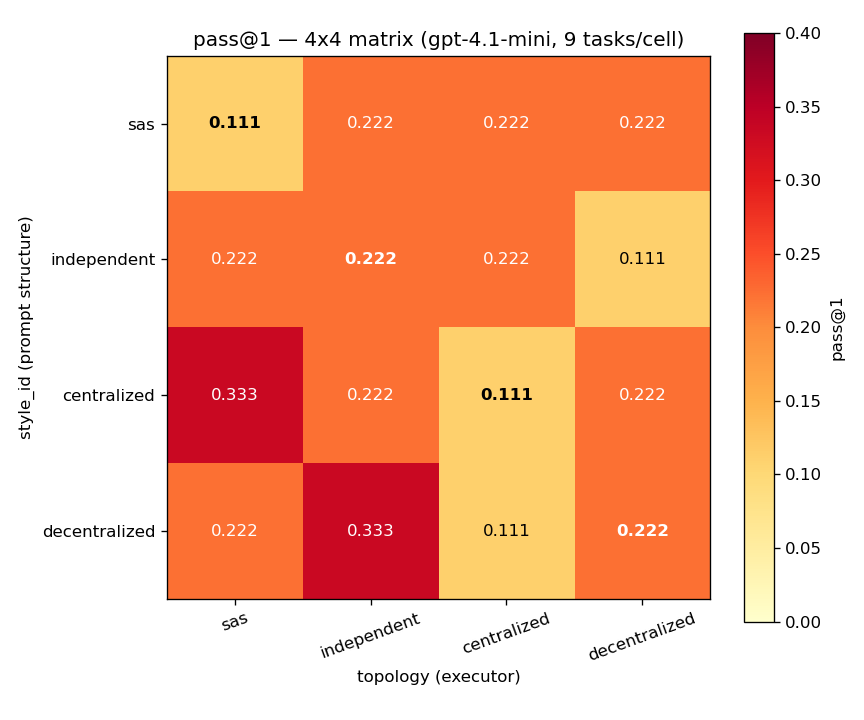
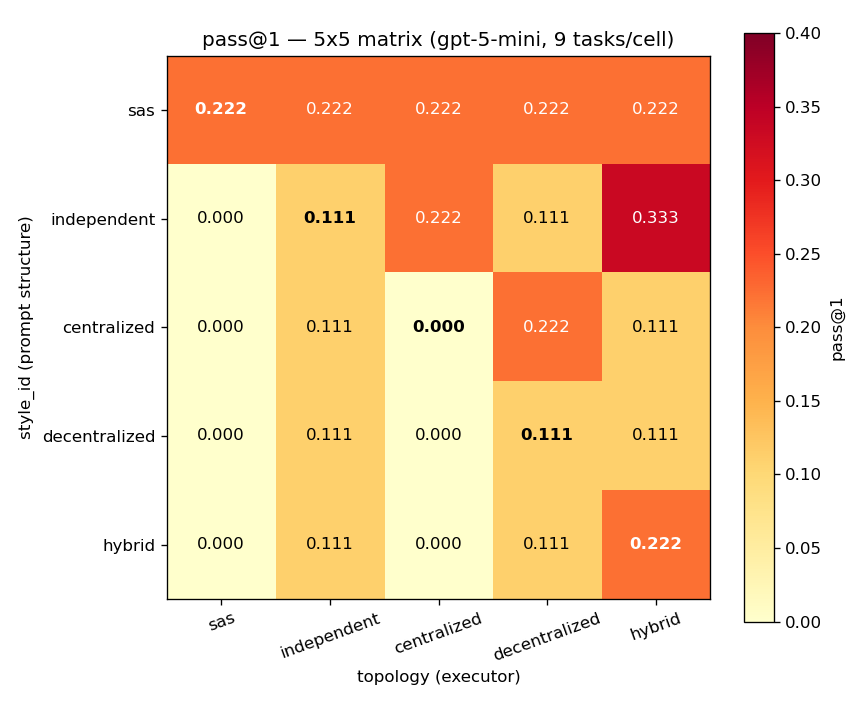
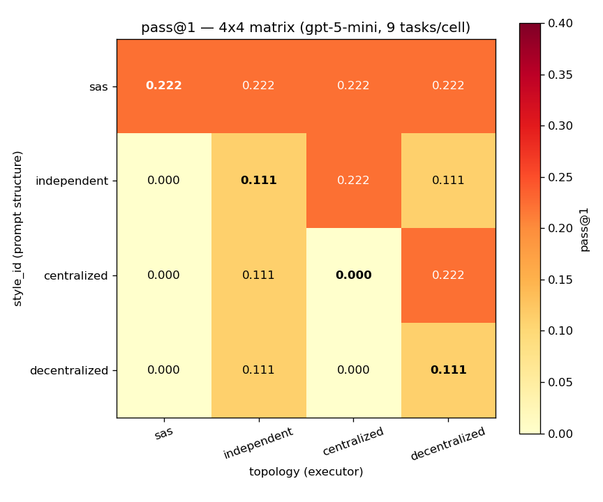
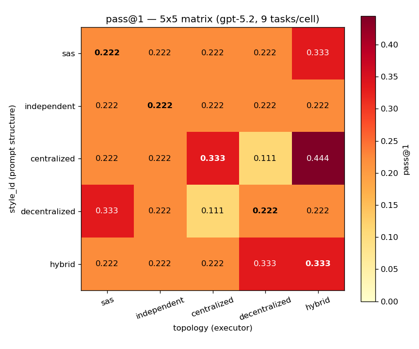
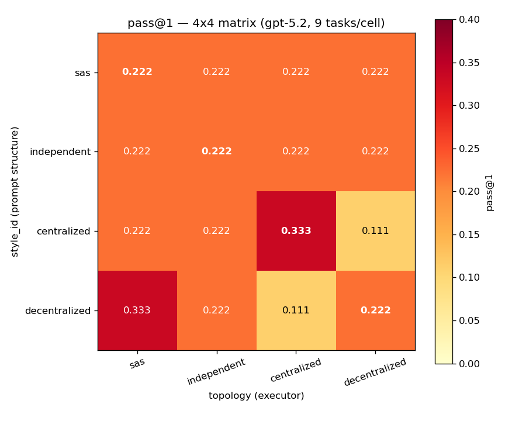
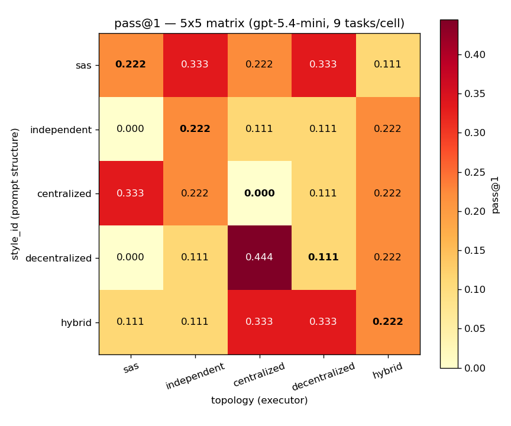
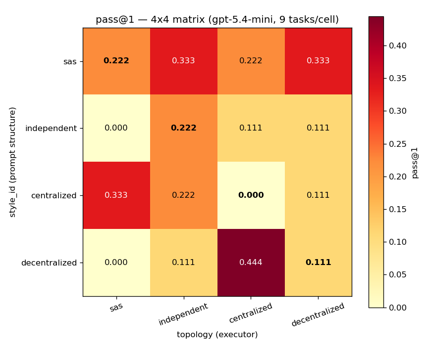

# mini_pilot_1 — 4 models × {5×5 (full), 4×4 (hybrid excluded)}

Per cell: 9 task replicates. Tasks: 9 TravelPlanner items.

Metric: `final_pass` (binary).

5×5 = full scope (hybrid included). 4×4 = alignment view (hybrid removed).


## Cross-model summary — 5x5

| model | aligned | misaligned | diff | Wilcoxon p | Perm p | Binom (strict) | Binom (tied) | SS%: style | topo | inter | resid |
|---|---|---|---|---|---|---|---|---|---|---|---|
| gpt-4.1-mini | 0.133 | 0.200 | -0.067 | 0.9289 | 0.9826 | 0/5 (p=1) | 1/5 (p=0.672) | 0.6% | 1.1% | 2.0% | 96.3% |
| gpt-5-mini | 0.133 | 0.122 | +0.011 | 0.3124 | 0.5147 | 1/5 (p=0.672) | 3/5 (p=0.0579) | 3.0% | 2.6% | 2.8% | 91.6% |
| gpt-5.2 | 0.267 | 0.239 | +0.028 | 0.2957 | 0.3102 | 0/5 (p=1) | 2/5 (p=0.263) | 0.2% | 0.6% | 1.8% | 97.3% |
| gpt-5.4-mini | 0.156 | 0.200 | -0.044 | 0.8719 | 0.7734 | 0/5 (p=1) | 1/5 (p=0.672) | 1.0% | 0.6% | 7.1% | 91.4% |

## Cross-model summary — 4x4

| model | aligned | misaligned | diff | Wilcoxon p | Perm p | Binom (strict) | Binom (tied) | SS%: style | topo | inter | resid |
|---|---|---|---|---|---|---|---|---|---|---|---|
| gpt-4.1-mini | 0.167 | 0.222 | -0.056 | 0.7295 | 0.9787 | 0/4 (p=1) | 1/4 (p=0.684) | 0.1% | 0.6% | 2.0% | 97.3% |
| gpt-5-mini | 0.111 | 0.120 | -0.009 | 0.3569 | 0.694 | 0/4 (p=1) | 2/4 (p=0.262) | 3.8% | 1.6% | 2.6% | 91.9% |
| gpt-5.2 | 0.250 | 0.213 | +0.037 | 0.4045 | 0.2895 | 1/4 (p=0.684) | 3/4 (p=0.0508) | 0.0% | 0.2% | 1.6% | 98.2% |
| gpt-5.4-mini | 0.139 | 0.194 | -0.056 | 0.8721 | 0.8259 | 1/4 (p=0.684) | 1/4 (p=0.684) | 2.5% | 0.7% | 8.2% | 88.7% |


## gpt-4.1-mini

### 5x5 — pass@1 matrix (9 tasks/cell)

```
topology         sas  independent  centralized  decentralized  hybrid
style_id                                                             
sas            0.111        0.222        0.222          0.222   0.111
independent    0.222        0.222        0.222          0.111   0.222
centralized    0.333        0.222        0.111          0.222   0.111
decentralized  0.222        0.333        0.111          0.222   0.222
hybrid         0.222        0.222        0.111          0.111   0.000
```


#### 5x5 — Paired Wilcoxon (aligned vs misaligned, per task)

- n_tasks = 9
- aligned mean = 0.133, misaligned mean = 0.200
- mean diff = -0.067, Cohen d = -0.495
- W = 10.50, p (one-sided, greater) = **0.9289**

#### 5x5 — Permutation test (25 cells reshuffled)

- actual diagonal mean = 0.1333
- null diagonal mean = 0.1863 ± 0.0308
- p (one-sided) = **0.9826** (n_perm = 10000)

#### 5x5 — Per-row max (Binomial)

- strict wins (unique argmax on diagonal): 0/5, p = **1**
- tied-or-wins (diagonal tied with max): 1/5, p = **0.6723**
- null: p_per_row = 0.20

```
        style  diag_value  row_max_value row_argmax_topology  n_cells_at_max  diag_is_strict_winner  diag_tied_with_max
          sas       0.111          0.222         independent               3                  False               False
  independent       0.222          0.222                 sas               4                  False                True
  centralized       0.111          0.333                 sas               1                  False               False
decentralized       0.222          0.333         independent               1                  False               False
       hybrid       0.000          0.222                 sas               2                  False               False
```

#### 5x5 — 2-way ANOVA SS decomposition

Cell-mean view (between-cell variation only):

```
                  source     SS  pct_total
Style (prompt structure) 0.0227    16.0839
                Topology 0.0425    30.0699
 Interaction (alignment) 0.0760    53.8462
   Total (between cells) 0.1412   100.0000
```

Trial-level view (includes within-cell residual):

```
                source      SS  pct_total
                 Style  0.2044     0.5985
              Topology  0.3822     1.1189
           Interaction  0.6844     2.0036
Residual (within cell) 32.8889    96.2789
                 Total 34.1600   100.0000
```

### 4x4 — pass@1 matrix (9 tasks/cell)

```
topology         sas  independent  centralized  decentralized
style_id                                                     
sas            0.111        0.222        0.222          0.222
independent    0.222        0.222        0.222          0.111
centralized    0.333        0.222        0.111          0.222
decentralized  0.222        0.333        0.111          0.222
```


#### 4x4 — Paired Wilcoxon (aligned vs misaligned, per task)

- n_tasks = 9
- aligned mean = 0.167, misaligned mean = 0.222
- mean diff = -0.056, Cohen d = -0.370
- W = 17.50, p (one-sided, greater) = **0.7295**

#### 4x4 — Permutation test (16 cells reshuffled)

- actual diagonal mean = 0.1667
- null diagonal mean = 0.2088 ± 0.0301
- p (one-sided) = **0.9787** (n_perm = 10000)

#### 4x4 — Per-row max (Binomial)

- strict wins (unique argmax on diagonal): 0/4, p = **1**
- tied-or-wins (diagonal tied with max): 1/4, p = **0.6836**
- null: p_per_row = 0.25

```
        style  diag_value  row_max_value row_argmax_topology  n_cells_at_max  diag_is_strict_winner  diag_tied_with_max
          sas       0.111          0.222         independent               3                  False               False
  independent       0.222          0.222                 sas               3                  False                True
  centralized       0.111          0.333                 sas               1                  False               False
decentralized       0.222          0.333         independent               1                  False               False
```

#### 4x4 — 2-way ANOVA SS decomposition

Cell-mean view (between-cell variation only):

```
                  source     SS  pct_total
Style (prompt structure) 0.0031     4.3478
                Topology 0.0154    21.7391
 Interaction (alignment) 0.0525    73.9130
   Total (between cells) 0.0710   100.0000
```

Trial-level view (includes within-cell residual):

```
                source      SS  pct_total
                 Style  0.0278     0.1170
              Topology  0.1389     0.5848
           Interaction  0.4722     1.9883
Residual (within cell) 23.1111    97.3099
                 Total 23.7500   100.0000
```


## gpt-5-mini

### 5x5 — pass@1 matrix (9 tasks/cell)

```
topology         sas  independent  centralized  decentralized  hybrid
style_id                                                             
sas            0.222        0.222        0.222          0.222   0.222
independent    0.000        0.111        0.222          0.111   0.333
centralized    0.000        0.111        0.000          0.222   0.111
decentralized  0.000        0.111        0.000          0.111   0.111
hybrid         0.000        0.111        0.000          0.111   0.222
```


#### 5x5 — Paired Wilcoxon (aligned vs misaligned, per task)

- n_tasks = 9
- aligned mean = 0.133, misaligned mean = 0.122
- mean diff = +0.011, Cohen d = 0.098
- W = 26.50, p (one-sided, greater) = **0.3124**

#### 5x5 — Permutation test (25 cells reshuffled)

- actual diagonal mean = 0.1333
- null diagonal mean = 0.1246 ± 0.0394
- p (one-sided) = **0.5147** (n_perm = 10000)

#### 5x5 — Per-row max (Binomial)

- strict wins (unique argmax on diagonal): 1/5, p = **0.6723**
- tied-or-wins (diagonal tied with max): 3/5, p = **0.05792**
- null: p_per_row = 0.20

```
        style  diag_value  row_max_value row_argmax_topology  n_cells_at_max  diag_is_strict_winner  diag_tied_with_max
          sas       0.222          0.222                 sas               5                  False                True
  independent       0.111          0.333              hybrid               1                  False               False
  centralized       0.000          0.222       decentralized               1                  False               False
decentralized       0.111          0.111         independent               3                  False                True
       hybrid       0.222          0.222              hybrid               1                   True                True
```

#### 5x5 — 2-way ANOVA SS decomposition

Cell-mean view (between-cell variation only):

```
                  source     SS  pct_total
Style (prompt structure) 0.0820    35.6223
                Topology 0.0721    31.3305
 Interaction (alignment) 0.0760    33.0472
   Total (between cells) 0.2301   100.0000
```

Trial-level view (includes within-cell residual):

```
                source      SS  pct_total
                 Style  0.7378     3.0094
              Topology  0.6489     2.6468
           Interaction  0.6844     2.7919
Residual (within cell) 22.4444    91.5518
                 Total 24.5156   100.0000
```

### 4x4 — pass@1 matrix (9 tasks/cell)

```
topology         sas  independent  centralized  decentralized
style_id                                                     
sas            0.222        0.222        0.222          0.222
independent    0.000        0.111        0.222          0.111
centralized    0.000        0.111        0.000          0.222
decentralized  0.000        0.111        0.000          0.111
```


#### 4x4 — Paired Wilcoxon (aligned vs misaligned, per task)

- n_tasks = 9
- aligned mean = 0.111, misaligned mean = 0.120
- mean diff = -0.009, Cohen d = -0.095
- W = 25.50, p (one-sided, greater) = **0.3569**

#### 4x4 — Permutation test (16 cells reshuffled)

- actual diagonal mean = 0.1111
- null diagonal mean = 0.1182 ± 0.0408
- p (one-sided) = **0.694** (n_perm = 10000)

#### 4x4 — Per-row max (Binomial)

- strict wins (unique argmax on diagonal): 0/4, p = **1**
- tied-or-wins (diagonal tied with max): 2/4, p = **0.2617**
- null: p_per_row = 0.25

```
        style  diag_value  row_max_value row_argmax_topology  n_cells_at_max  diag_is_strict_winner  diag_tied_with_max
          sas       0.222          0.222                 sas               4                  False                True
  independent       0.111          0.222         centralized               1                  False               False
  centralized       0.000          0.222       decentralized               1                  False               False
decentralized       0.111          0.111         independent               2                  False                True
```

#### 4x4 — 2-way ANOVA SS decomposition

Cell-mean view (between-cell variation only):

```
                  source    SS  pct_total
Style (prompt structure) 0.064    47.4286
                Topology 0.027    20.0000
 Interaction (alignment) 0.044    32.5714
   Total (between cells) 0.135   100.0000
```

Trial-level view (includes within-cell residual):

```
                source      SS  pct_total
                 Style  0.5764     3.8444
              Topology  0.2431     1.6211
           Interaction  0.3958     2.6401
Residual (within cell) 13.7778    91.8944
                 Total 14.9931   100.0000
```


## gpt-5.2

### 5x5 — pass@1 matrix (9 tasks/cell)

```
topology         sas  independent  centralized  decentralized  hybrid
style_id                                                             
sas            0.222        0.222        0.222          0.222   0.333
independent    0.222        0.222        0.222          0.222   0.222
centralized    0.222        0.222        0.333          0.111   0.444
decentralized  0.333        0.222        0.111          0.222   0.222
hybrid         0.222        0.222        0.222          0.333   0.333
```


#### 5x5 — Paired Wilcoxon (aligned vs misaligned, per task)

- n_tasks = 9
- aligned mean = 0.267, misaligned mean = 0.239
- mean diff = +0.028, Cohen d = 0.307
- W = 27.00, p (one-sided, greater) = **0.2957**

#### 5x5 — Permutation test (25 cells reshuffled)

- actual diagonal mean = 0.2667
- null diagonal mean = 0.2445 ± 0.0286
- p (one-sided) = **0.3102** (n_perm = 10000)

#### 5x5 — Per-row max (Binomial)

- strict wins (unique argmax on diagonal): 0/5, p = **1**
- tied-or-wins (diagonal tied with max): 2/5, p = **0.2627**
- null: p_per_row = 0.20

```
        style  diag_value  row_max_value row_argmax_topology  n_cells_at_max  diag_is_strict_winner  diag_tied_with_max
          sas       0.222          0.333              hybrid               1                  False               False
  independent       0.222          0.222                 sas               5                  False                True
  centralized       0.333          0.444              hybrid               1                  False               False
decentralized       0.222          0.333                 sas               1                  False               False
       hybrid       0.333          0.333       decentralized               2                  False                True
```

#### 5x5 — 2-way ANOVA SS decomposition

Cell-mean view (between-cell variation only):

```
                  source     SS  pct_total
Style (prompt structure) 0.0099        8.0
                Topology 0.0296       24.0
 Interaction (alignment) 0.0840       68.0
   Total (between cells) 0.1235      100.0
```

Trial-level view (includes within-cell residual):

```
                source      SS  pct_total
                 Style  0.0889     0.2139
              Topology  0.2667     0.6417
           Interaction  0.7556     1.8182
Residual (within cell) 40.4444    97.3262
                 Total 41.5556   100.0000
```

### 4x4 — pass@1 matrix (9 tasks/cell)

```
topology         sas  independent  centralized  decentralized
style_id                                                     
sas            0.222        0.222        0.222          0.222
independent    0.222        0.222        0.222          0.222
centralized    0.222        0.222        0.333          0.111
decentralized  0.333        0.222        0.111          0.222
```


#### 4x4 — Paired Wilcoxon (aligned vs misaligned, per task)

- n_tasks = 9
- aligned mean = 0.250, misaligned mean = 0.213
- mean diff = +0.037, Cohen d = 0.294
- W = 24.50, p (one-sided, greater) = **0.4045**

#### 4x4 — Permutation test (16 cells reshuffled)

- actual diagonal mean = 0.2500
- null diagonal mean = 0.2222 ± 0.0246
- p (one-sided) = **0.2895** (n_perm = 10000)

#### 4x4 — Per-row max (Binomial)

- strict wins (unique argmax on diagonal): 1/4, p = **0.6836**
- tied-or-wins (diagonal tied with max): 3/4, p = **0.05078**
- null: p_per_row = 0.25

```
        style  diag_value  row_max_value row_argmax_topology  n_cells_at_max  diag_is_strict_winner  diag_tied_with_max
          sas       0.222          0.222                 sas               4                  False                True
  independent       0.222          0.222                 sas               4                  False                True
  centralized       0.333          0.333         centralized               1                   True                True
decentralized       0.222          0.333                 sas               1                  False               False
```

#### 4x4 — 2-way ANOVA SS decomposition

Cell-mean view (between-cell variation only):

```
                  source     SS  pct_total
Style (prompt structure) 0.0000        0.0
                Topology 0.0062       12.5
 Interaction (alignment) 0.0432       87.5
   Total (between cells) 0.0494      100.0
```

Trial-level view (includes within-cell residual):

```
                source      SS  pct_total
                 Style  0.0000     0.0000
              Topology  0.0556     0.2232
           Interaction  0.3889     1.5625
Residual (within cell) 24.4444    98.2143
                 Total 24.8889   100.0000
```


## gpt-5.4-mini

### 5x5 — pass@1 matrix (9 tasks/cell)

```
topology         sas  independent  centralized  decentralized  hybrid
style_id                                                             
sas            0.222        0.333        0.222          0.333   0.111
independent    0.000        0.222        0.111          0.111   0.222
centralized    0.333        0.222        0.000          0.111   0.222
decentralized  0.000        0.111        0.444          0.111   0.222
hybrid         0.111        0.111        0.333          0.333   0.222
```


#### 5x5 — Paired Wilcoxon (aligned vs misaligned, per task)

- n_tasks = 9
- aligned mean = 0.156, misaligned mean = 0.200
- mean diff = -0.044, Cohen d = -0.367
- W = 13.00, p (one-sided, greater) = **0.8719**

#### 5x5 — Permutation test (25 cells reshuffled)

- actual diagonal mean = 0.1556
- null diagonal mean = 0.1916 ± 0.0474
- p (one-sided) = **0.7734** (n_perm = 10000)

#### 5x5 — Per-row max (Binomial)

- strict wins (unique argmax on diagonal): 0/5, p = **1**
- tied-or-wins (diagonal tied with max): 1/5, p = **0.6723**
- null: p_per_row = 0.20

```
        style  diag_value  row_max_value row_argmax_topology  n_cells_at_max  diag_is_strict_winner  diag_tied_with_max
          sas       0.222          0.333         independent               2                  False               False
  independent       0.222          0.222         independent               2                  False                True
  centralized       0.000          0.333                 sas               1                  False               False
decentralized       0.111          0.444         centralized               1                  False               False
       hybrid       0.222          0.333         centralized               2                  False               False
```

#### 5x5 — 2-way ANOVA SS decomposition

Cell-mean view (between-cell variation only):

```
                  source     SS  pct_total
Style (prompt structure) 0.0375    11.2426
                Topology 0.0227     6.8047
 Interaction (alignment) 0.2736    81.9527
   Total (between cells) 0.3338   100.0000
```

Trial-level view (includes within-cell residual):

```
                source      SS  pct_total
                 Style  0.3378     0.9711
              Topology  0.2044     0.5878
           Interaction  2.4622     7.0790
Residual (within cell) 31.7778    91.3621
                 Total 34.7822   100.0000
```

### 4x4 — pass@1 matrix (9 tasks/cell)

```
topology         sas  independent  centralized  decentralized
style_id                                                     
sas            0.222        0.333        0.222          0.333
independent    0.000        0.222        0.111          0.111
centralized    0.333        0.222        0.000          0.111
decentralized  0.000        0.111        0.444          0.111
```


#### 4x4 — Paired Wilcoxon (aligned vs misaligned, per task)

- n_tasks = 9
- aligned mean = 0.139, misaligned mean = 0.194
- mean diff = -0.056, Cohen d = -0.471
- W = 13.00, p (one-sided, greater) = **0.8721**

#### 4x4 — Permutation test (16 cells reshuffled)

- actual diagonal mean = 0.1389
- null diagonal mean = 0.1807 ± 0.0576
- p (one-sided) = **0.8259** (n_perm = 10000)

#### 4x4 — Per-row max (Binomial)

- strict wins (unique argmax on diagonal): 1/4, p = **0.6836**
- tied-or-wins (diagonal tied with max): 1/4, p = **0.6836**
- null: p_per_row = 0.25

```
        style  diag_value  row_max_value row_argmax_topology  n_cells_at_max  diag_is_strict_winner  diag_tied_with_max
          sas       0.222          0.333         independent               2                  False               False
  independent       0.222          0.222         independent               1                   True                True
  centralized       0.000          0.333                 sas               1                  False               False
decentralized       0.111          0.444         centralized               1                  False               False
```

#### 4x4 — 2-way ANOVA SS decomposition

Cell-mean view (between-cell variation only):

```
                  source     SS  pct_total
Style (prompt structure) 0.0586    21.8391
                Topology 0.0154     5.7471
 Interaction (alignment) 0.1944    72.4138
   Total (between cells) 0.2685   100.0000
```

Trial-level view (includes within-cell residual):

```
                source      SS  pct_total
                 Style  0.5278     2.4772
              Topology  0.1389     0.6519
           Interaction  1.7500     8.2138
Residual (within cell) 18.8889    88.6571
                 Total 21.3056   100.0000
```
